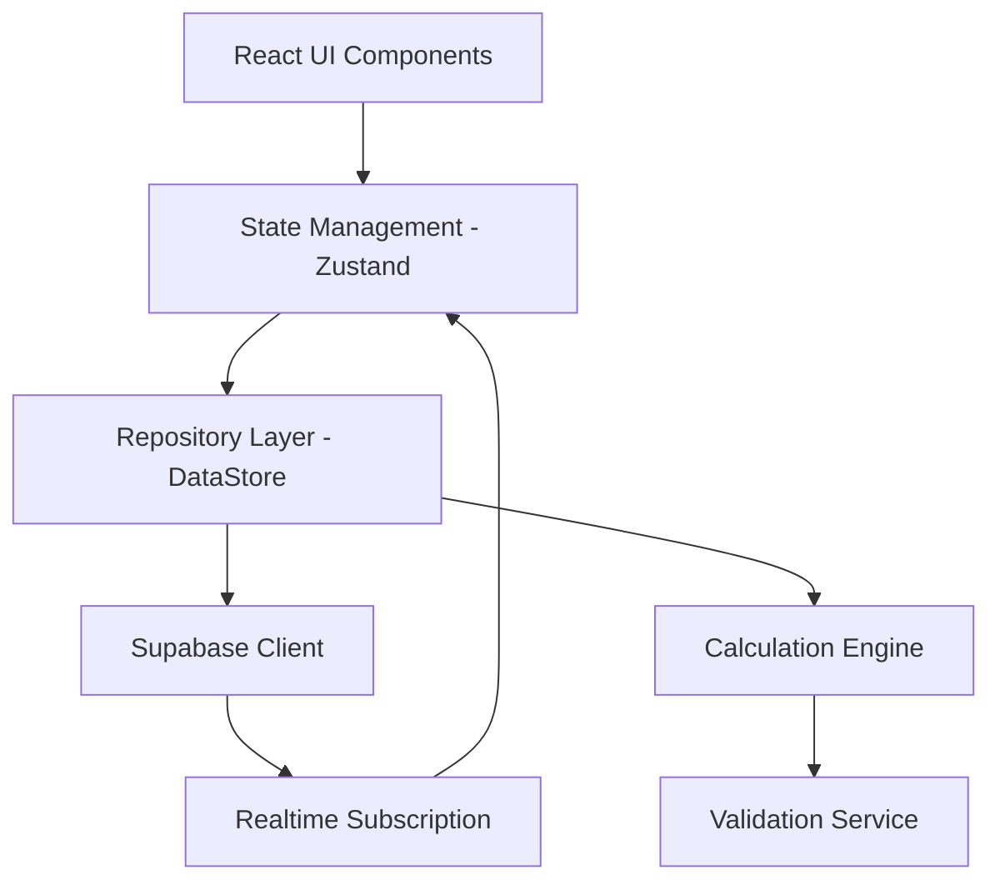

# Technical Design Document

## Overview

Settlr is a cloud-synced React web application that enables intelligent expense splitting among group members using configurable fairness weights. The system implements three split methods (Equal, Fairness, Custom Percentage) with real-time synchronization, debt simplification algorithms, monthly analytics with visualizations, and persistent cloud storage via Supabase. The architecture emphasizes mathematical correctness, data security via Row-Level Security (RLS), and a mobile-first user experience with dark mode support.

### Key Design Principles

1. **Mathematical Correctness**: All split calculations must maintain invariants (sum of shares = total amount, net group balance = 0)
2. **Transparency**: Every calculation must be explainable in plain English to build user trust
3. **Cloud-Synced**: Data persists in Supabase Postgres with real-time updates across all member devices
4. **Mobile-First**: Responsive design optimized for touch interfaces
5. **Immediate Feedback**: Optimistic UI updates with real-time validation and calculation previews

## Architecture

### High-Level Architecture



### Technology Stack

- **Frontend Framework**: React 18+ with TypeScript
- **Styling**: Tailwind CSS
- **State Management**: Zustand (Client-side cache for cloud data)
- **Backend/Database**: Supabase (PostgreSQL + Auth + Realtime)
- **Charting**: Recharts for visualizations
- **Build Tool**: Vite
- **Testing**: Vitest + fast-check (Property-based testing)

### Architectural Layers

1. **Presentation Layer** (React Components)
   - Auth components (Login, Signup, Email Verification)
   - Page components (Home, GroupDetail, MonthlyDashboard)
   - Feature components (ExpenseForm, BalanceSummary, SettlementForm, ExplanationModal)
   - UI components (Button, Card, Modal, Input, Skeleton, Banner, Toast)

2. **State Management Layer** (Zustand Store)
   - Reflects the latest server data
   - Handles optimistic updates and rollbacks

3. **Repository Layer (DataStore Interface)**
   - `DataStore`: Abstract interface for all CRUD operations
   - `SupabaseStore`: Primary implementation using `@supabase/supabase-js`

4. **Business Logic Layer**
   - Calculation Engine (Pure functions for split math)
   - Debt Simplification Algorithm (Greedy matching)
   - Validation Service

5. **Backend Layer (Supabase)**
   - Auth: Email/Password
   - PostgreSQL: Relational storage
   - Realtime: WebSocket-based row updates

## Async Data & UX Patterns

### Loading & Error States
- **Skeletons**: Displayed during initial data fetches (e.g., group list, expense history)
- **Spinners**: Displayed during mutations (e.g., saving an expense)
- **Error Banners**: Global or component-level banners allowing users to retry failed fetches
- **Toasts**: Non-blocking feedback for successful or failed mutations

### Optimistic Updates
1. User submits change (e.g., add expense)
2. UI updates Zustand store immediately with a temporary ID
3. App sends request to Supabase
4. **Success**: App replaces temporary ID with server-assigned UUID
5. **Failure**: App rolls back the store state and shows an error toast

### Session & Auth Flow
- **Signup**: User submits email/password → Blocked until email verified
- **Login**: Successful auth stores session in local browser storage (managed by Supabase)
- **Expiry**: 401/403 responses from Supabase trigger a redirect to login with a "Session expired" toast
- **Offline Detection**: App monitors `navigator.onLine`. Shows a "You are currently offline" banner. Prevents mutations while offline.

## Components and Interfaces

### Core Data Models

```typescript
// Domain Types
type FairnessWeight = number; // Positive number, default 1

interface Member {
  id: string; // UUID from group_members table
  groupId: string;
  userId: string | null; // null for Guest members
  displayName: string;
  fairnessWeight: FairnessWeight;
  isGuest: boolean;
}

type SplitMethod = 'equal' | 'fairness' | 'custom';

interface MemberShare {
  memberId: string; // Refers to Member.id (group_member UUID)
  amount: number;
  weight?: number; // Per-expense weight override
  percentage?: number; // For custom splits
}

interface Expense {
  id: string;
  groupId: string;
  title: string;
  amount: number;
  paidBy: string; // Member.id
  date: string;
  category: string;
  splitMethod: SplitMethod;
  shares: MemberShare[];
  createdAt: string;
}

interface Settlement {
  id: string;
  groupId: string;
  fromMember: string; // Member ID
  toMember: string; // Member ID
  amount: number;
  date: string;
  note?: string;
  createdAt: string;
}

interface Group {
  id: string;
  name: string;
  members: Member[];
  createdAt: string;
  createdBy: string; // User ID
}
```

### DataStore Interface

```typescript
interface DataStore {
  fetchGroups(): Promise<Group[]>;
  createGroup(name: string): Promise<Group>;
  fetchExpenses(groupId: string): Promise<Expense[]>;
  createExpense(expense: Omit<Expense, 'id' | 'createdAt'>): Promise<Expense>;
  deleteExpense(id: string): Promise<void>;
  fetchSettlements(groupId: string): Promise<Settlement[]>;
  createSettlement(settlement: Omit<Settlement, 'id' | 'createdAt'>): Promise<Settlement>;
  // ... other CRUD methods
}
```

### Calculation Engine Interface

```typescript
interface CalculationEngine {
  /**
   * Calculate member shares for an expense based on split method
   */
  calculateShares(
    amount: number,
    members: Member[],
    splitMethod: SplitMethod,
    customShares?: MemberShare[]
  ): MemberShare[];

  /**
   * Calculate net balances for all members in a group
   */
  calculateBalances(
    members: Member[],
    expenses: Expense[],
    settlements: Settlement[]
  ): Balance[];

  /**
   * Generate human-readable explanation of split calculation
   */
  explainSplit(expense: Expense, members: Member[]): string;

  /**
   * Validate that shares sum to total amount within tolerance
   */
  validateShareSum(shares: MemberShare[], totalAmount: number): boolean;
}
```

### UI Component: ExplanationModal

The `ExplanationModal` component displays step-by-step calculation explanations for expenses.

**Props:**
```typescript
interface ExplanationModalProps {
  expense: Expense;
  members: Member[];
  isOpen: boolean;
  onClose: () => void;
}
```

**Invocation:**
- Triggered from the expense list when user clicks the "Why?" link next to any expense
- The expense list item component maintains `isModalOpen` state
- Clicking "Why?" sets `isModalOpen = true` and passes the expense and members to the modal
- Modal displays calculation breakdown based on split method
- User can dismiss by clicking outside, pressing Escape, or clicking the close button

### Debt Simplification Algorithm

The system uses a **greedy algorithm** to minimize the number of transactions:

**Pseudocode:**
```
function simplifyDebts(balances):
  // Separate creditors (positive balance) and debtors (negative balance)
  creditors = balances.filter(b => b.netBalance > 0).sort(descending)
  debtors = balances.filter(b => b.netBalance < 0).sort(ascending)
  
  transactions = []
  
  while creditors is not empty AND debtors is not empty:
    largestCreditor = creditors[0]
    largestDebtor = debtors[0]
    
    // Match them with the minimum of what's owed and what's due
    amount = min(largestCreditor.netBalance, abs(largestDebtor.netBalance))
    
    transactions.push({
      from: largestDebtor.memberId,
      to: largestCreditor.memberId,
      amount: amount
    })
    
    // Update balances
    largestCreditor.netBalance -= amount
    largestDebtor.netBalance += amount
    
    // Remove members with zero balance
    if largestCreditor.netBalance == 0:
      creditors.remove(largestCreditor)
    if largestDebtor.netBalance == 0:
      debtors.remove(largestDebtor)
  
  return transactions
```

### Validation Service Interface

```typescript
interface ValidationService {
  validateGroupName(name: string): ValidationResult;
  validateMemberName(name: string): ValidationResult;
  validateExpenseAmount(amount: number): ValidationResult;
  validateFairnessWeight(weight: number): ValidationResult;
  validateCustomPercentages(shares: MemberShare[]): ValidationResult;
  validateSettlement(settlement: Omit<Settlement, 'id' | 'createdAt'>): ValidationResult;
}

interface ValidationResult {
  valid: boolean;
  errors: string[];
}
```

## Database Schema (PostgreSQL)

```sql
-- Enable UUID extension
create extension if not exists "uuid-ossp";

-- Groups Table
create table groups (
  id uuid primary key default uuid_generate_v4(),
  name text not null,
  created_at timestamp with time zone default now(),
  created_by uuid references auth.users(id),
  is_archived boolean default false          -- soft-delete flag (Phase 7)
);

-- Group Members Table
-- A group member can be a registered user (linked via user_id) or a guest.
create table group_members (
  id uuid primary key default uuid_generate_v4(),
  group_id uuid references groups(id) on delete cascade,
  user_id uuid references auth.users(id) on delete cascade, -- nullable for guests
  display_name text not null, -- always required
  fairness_weight numeric default 1.0 check (fairness_weight > 0),
  is_guest boolean default false,
  joined_at timestamp with time zone default now(),
  unique(group_id, user_id) -- only enforced when user_id is not null
);

-- Expenses Table
create table expenses (
  id uuid primary key default uuid_generate_v4(),
  group_id uuid references groups(id) on delete cascade,
  title text not null,
  amount numeric not null check (amount > 0),
  paid_by uuid references group_members(id), -- links to member, not user
  date date not null,
  category text not null,
  split_method text not null,
  notes text,                                -- optional free-text note (Phase 7)
  created_at timestamp with time zone default now()
);

-- Expense Shares Table
create table expense_shares (
  id uuid primary key default uuid_generate_v4(),
  expense_id uuid references expenses(id) on delete cascade,
  member_id uuid references group_members(id) on delete cascade,
  amount numeric not null,
  weight numeric,
  percentage numeric,
  unique(expense_id, member_id)
);

-- Settlements Table
create table settlements (
  id uuid primary key default uuid_generate_v4(),
  group_id uuid references groups(id) on delete cascade,
  from_member uuid references group_members(id),
  to_member uuid references group_members(id),
  amount numeric not null check (amount > 0),
  date date not null,
  note text,
  created_at timestamp with time zone default now()
);
```

## Row-Level Security (RLS) Policies

### Groups
- **SELECT**: Authenticated users can see groups where they exist in `group_members`
- **INSERT**: Authenticated users can create groups
- **DELETE**: Only `created_by` user can delete

### Expenses & Settlements
- **ALL**: Restricted to users who are members of the associated `group_id`

## Real-time Sync

The app subscribes to updates per group:

```typescript
supabase
  .channel(`group-${groupId}`)
  .on('postgres_changes', { 
    event: '*', 
    schema: 'public', 
    table: 'expenses',
    filter: `group_id=eq.${groupId}`
  }, payload => {
    // Update store state
  })
  .on('postgres_changes', { 
    event: '*', 
    schema: 'public', 
    table: 'settlements',
    filter: `group_id=eq.${groupId}`
  }, payload => {
    // Update store state
  })
  .on('postgres_changes', { 
    event: '*', 
    schema: 'public', 
    table: 'group_members',
    filter: `group_id=eq.${groupId}`
  }, payload => {
    // Update store state
  })
  .subscribe()
```

## Correctness Properties

### Property 20: User Data Isolation
*For any* authenticated user, queries to fetch data SHALL only return records where the user is a verified member in the `group_members` table for that specific group.

### Property 3: Share Sum Invariant
Sum of shares = total expense amount ± 0.01.

### Property 7: Debt Simplification Preserves Balances
*For any* set of member balances, the simplified debts SHALL:
1. Preserve each member's net balance exactly (within 0.01 tolerance)
2. Require fewer or equal transactions compared to direct pairwise settlement

### Property 8: Group Net Balance is Zero
*For any* group with expenses and settlements, the sum of all member net balances SHALL equal zero within 0.01 tolerance (money in = money out).

## Mock Data Specification

The application includes a manual seed script that populates the Supabase database with realistic mock data for development. **Note**: This replaces the previous localStorage auto-load logic.

### Mock Data Contents:

**Group 1: "Roommates"**
- **Members** (3):
  - Alice (fairness weight: 1)
  - Bob (fairness weight: 1)
  - Charlie (fairness weight: 2) — demonstrates higher contribution share
- **Expenses** (5):
  1. "Groceries" - $120, paid by Alice, Equal split, Food category
  2. "Internet Bill" - $60, paid by Bob, Fairness split, Utilities category
  3. "Movie Night" - $45, paid by Charlie, Equal split, Entertainment category
  4. "Electricity" - $90, paid by Alice, Fairness split, Utilities category
  5. "Takeout Dinner" - $75, paid by Bob, Custom split (Alice: 30%, Bob: 30%, Charlie: 40%), Food category
- **Settlements** (1):
  - Bob paid Alice $50 on [recent date], note: "Venmo'd for last month"

**Group 2: "Weekend Trip"**
- **Members** (4):
  - Dana (fairness weight: 1)
  - Eve (fairness weight: 0.5) — demonstrates lower contribution share
  - Frank (fairness weight: 1)
  - Grace (fairness weight: 1)
- **Expenses** (3):
  1. "Airbnb" - $400, paid by Dana, Fairness split, Travel category
  2. "Gas" - $80, paid by Frank, Equal split, Transport category
  3. "Restaurant" - $150, paid by Grace, Fairness split, Food category

## Testing Strategy

### Unit Testing

**Library**: Vitest + React Testing Library

**Unit Test Coverage (2-3 examples per requirement)**:

1. **Split Calculations**
   - Equal split: Test with 3 members, $100 expense → each pays $33.33
   - Fairness split: Test with weights [0.5, 1, 2], $100 expense → shares [$14.29, $28.57, $57.14]
   - Custom split: Test with percentages [30%, 30%, 40%], $100 expense → shares [$30, $30, $40]

2. **Balance Calculations**
   - Test: Alice pays $100, owes $50 → balance = +$50
   - Test: Bob pays $0, owes $50 → balance = -$50
   - Test: With settlement: Alice pays Bob $50 → both balances = $0

3. **Validation Rules**
   - Positive numbers: Test with 0, -5, "abc" → all rejected
   - Names: Test with "", "   ", "Alice" → first two rejected, last accepted
   - Percentages: Test with [50%, 50%], [33%, 33%, 33%], [100%] → first two accepted, last rejected

4. **Formatting**
   - Test: 10 → "$10.00"
   - Test: 33.333 → "$33.33"

5. **Monthly Calculations**
   - Total: Test with 3 expenses [$50, $75, $100] → total = $225
   - Top spender: Test with Alice paid $150, Bob paid $75 → Alice is top
   - Biggest expense: Test with expenses [$50, $100, $75] → $100 is biggest

### Test Organization

```
tests/
├── unit/
│   ├── components/
│   ├── services/
│   │   ├── CalculationEngine.test.ts
│   │   ├── DebtSimplifier.test.ts
│   │   └── ValidationService.test.ts
│   └── utils/
├── property/
│   ├── share-sum-invariant.property.test.ts
│   ├── debt-simplification.property.test.ts
│   ├── group-balance-zero.property.test.ts
│   └── generators.ts (custom fast-check generators)
└── integration/
    ├── workflows.test.tsx
    └── supabase-persistence.test.tsx
```

### Custom Generators for Property Tests

```typescript
// generators.ts
import fc from 'fast-check';

export const memberArb = fc.record({
  id: fc.uuid(),
  groupId: fc.uuid(),
  userId: fc.option(fc.uuid()),
  displayName: fc.string({ minLength: 1, maxLength: 20 }),
  fairnessWeight: fc.double({ min: 0.1, max: 5, noNaN: true }),
  isGuest: fc.boolean()
});

export const expenseArb = (groupId: string, memberIds: string[]) =>
  fc.record({
    id: fc.uuid(),
    groupId: fc.constant(groupId),
    title: fc.string({ minLength: 1, maxLength: 50 }),
    amount: fc.double({ min: 0.01, max: 10000, noNaN: true }),
    paidBy: fc.constantFrom(...memberIds),
    date: fc.date({ min: new Date('2020-01-01'), max: new Date('2025-12-31') })
      .map(d => d.toISOString().split('T')[0]),
    category: fc.constantFrom('Food', 'Transport', 'Entertainment', 'Utilities', 'Shopping', 'Travel', 'Other'),
    splitMethod: fc.constantFrom('equal', 'fairness', 'custom'),
    shares: fc.constant([]),
    createdAt: fc.date().map(d => d.toISOString())
  });
```

### Integration Testing

1. **User Workflows**
   - Signup → Email verification → Create group → Add guest → Add expense
   - Add expense → Verify real-time update in secondary window
2. **Supabase Persistence**
   - Create data → Refresh page → Verify fetch from Supabase
   - Verify RLS: User A cannot fetch User B's group data
3. **Calculation Pipelines**
   - Add multiple expenses/settlements → Verify balances via Supabase fetch matches local CE calculation

## Error Handling

### Supabase Errors
- **Network Failure**: Show offline banner and block mutations
- **Auth Errors (401/403)**: Redirect to login with session expiry notice
- **Postgres Errors**: Show error toast and rollback optimistic update
- **Rate Limiting**: Implementation of exponential backoff for retries

### Validation Errors
- Form-level feedback (red text, disabled submit)
- Live preview showing invalid split totals (e.g., custom percentages ≠ 100%)
